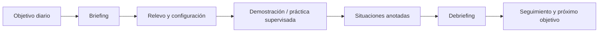

---
tags:
  - habilitacion-twr
  - ojt
---

# Primeros cuatro días OJT

Volver a [[00 - Inicio]]. Síntesis del plan guía del manual, pp. 12–19. Es flexible: el OJTI puede adaptarlo a la operación y al diagnóstico del entrenando.

## Avance real

- **Jornada 1 realizada:** el contenido no siguió estrictamente el orden previsto. Se adelantaron aeródromo, espacio aéreo, performance, rutas VFR, fajas, fraseología y cartas de acuerdo con CAISA y Helipuerto SUR.
- **Seguimiento del entorno de trabajo:** la nota 01 marca tratados briefing/relevo, fuentes y reconocimiento de equipos; completar/verificar su aplicación en el puesto. En las jornadas 1–4 hubo coordinaciones esporádicas como Planificador.
- **Preparación del día 2:** MADE SULS capítulos 4 y 5 y Doc. 4444 capítulo 7.
- **Jornada 2 — teoría terminada:** repaso de MADE 4 y 5 y Doc. 4444 capítulo 7; mapa ciego; tránsito y circuitos.
- **Jornada 2 — práctica:** aproximadamente **3–4 h como Ejecutivo**, con coordinaciones esporádicas como Planificador.
- **Jornada 3 — programa completado:** procedimientos y coordinaciones APP–TWR, GRF/CAISA, METAR/SPECI y CAO meteo, cartas de aproximación, contingencias previstas y aeródromos/modelos habituales; confirmado por el entrenando el 08/09/2026.
- **Jornada 3 — práctica:** aproximadamente **3–4 h como Ejecutivo**, controlando varias aproximaciones VOR y RNP a distintas pistas, con coordinaciones esporádicas como Planificador.
- **Lectura COA:** completada dentro de las lecturas del día 4, ya resumida en [[Resumen día 3]].
- **Práctica acumulada jornadas 1–4:** aproximadamente **12–16 h como Ejecutivo** (3–4 h diarias), más coordinaciones esporádicas como Planificador cuya duración no fue registrada.
- **Lecturas del día 4 completadas:** PEA SULS y alertas, COA, QNH/QFE/QNE, TAF/SIGMET y fenómenos asociados; confirmadas el 10/09/2026. No hay aún notas de práctica ni correcciones.
- Notas: [[Resumen día 1]], [[Resumen día 2]], [[Resumen día 3]] y [[Balance jornadas 1 a 3 - Pendientes y día 4]].

## Rutina común de cada jornada

## Día 1 — Familiarización y planificador

### Se espera trabajar

- briefing, relevo y debriefing;
- distribución de tareas y responsabilidades;
- CRM, MADOR y checklist de relevo;
- equipos CNS, frecuencias principales y de reserva;
- meteorología, pista en uso y reportes relevantes;
- libro de guardia, NOTAM, PIB y circulares;
- configuración de pantalla;
- principios operativos de la posición de planificador.

### Llegar pudiendo responder

- ¿Qué fuentes debo comprobar al recibir el puesto?
- ¿Qué cambia si un equipo o frecuencia está degradado?
- ¿Qué datos no pueden faltar en un relevo?
- ¿Cómo confirmo que entendí correctamente la situación?

## Día 2 — Espacio aéreo y práctica de planificación

### Se espera trabajar

- resumen del día anterior;
- relevo con las variables presentes;
- espacio de jurisdicción, clasificación y estructura;
- declinación magnética y limitaciones operacionales;
- servicio proporcionado;
- verificación de radioayudas;
- práctica como planificador.

### Preparación recomendada

- dibujar límites y sectores adyacentes;
- asociar cada porción de espacio con servicio, procedimiento y coordinación;
- practicar detección anticipada de puntos de conflicto.

## Día 3 — Coordinaciones, contingencias y ejecutivo

> Programa de la jornada completado. La lectura COA y el plan de emergencia, trasladados a la jornada 4 según la asignación real, fueron completados el 10/09/2026.

### Se espera trabajar

- cartas de acuerdo y procedimientos del sector;
- aproximaciones instrumentales, SID y STAR aplicables;
- coordinaciones y transferencias;
- plan de emergencia;
- contingencias y fallas CNS;
- inicio de práctica bajo supervisión como ejecutivo.

### Preparación recomendada

- transformar las cartas de acuerdo en reglas breves de decisión;
- practicar quién coordina, qué coordina, cuándo y por qué medio;
- ensayar prioridades ante una situación no rutinaria.

## Día 4 — Integración operativa

### Se espera trabajar

- briefing, relevo y práctica en posiciones;
- fraseología;
- información de posición y de tránsito;
- contingencias;
- procedimientos de control de aeródromo del Doc. 4444;
- práctica como ejecutivo.

Desde aquí, las jornadas sucesivas se determinan según el seguimiento y las necesidades observadas.

## Dudas para llevar al OJTI

- [ ] ¿Cuál es el formato local esperado para el briefing y el relevo?
- [ ] ¿Qué documentación se revisa obligatoriamente al inicio?
- [ ] ¿Cuáles son los errores más frecuentes de quienes comienzan?
- [ ] ¿Qué aspectos se espera dominar antes de pasar al puesto ejecutivo?
- [ ] ¿Cómo se registran y priorizan los puntos a reforzar?
